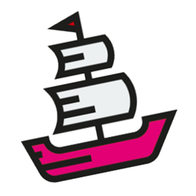
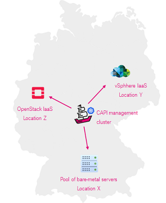
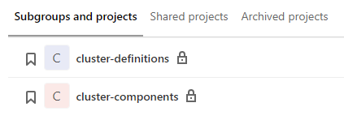
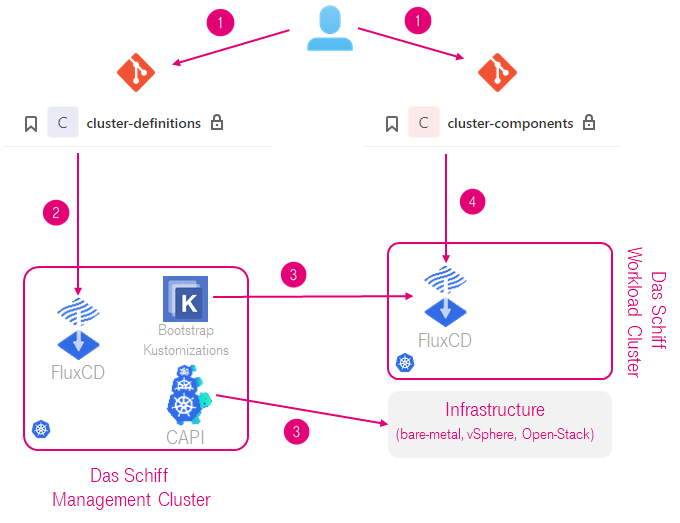

<p align="center"></p>

<p align="center">
    <a href="https://github.com/telekom/das-schiff/commits/" title="Last Commit"></a>
    <a href="https://github.com/telekom/das-schiff/issues" title="Open Issues"></a>
    <a href="https://github.com/telekom/das-schiff/blob/master/LICENSE" title="License"></a>
</p>

# Das Schiff

## This is still work in progress. Please watch this repo for updates soon.

#### Useful links

- [Licensing](#licensing)
- [Das Schiff Pure Metal](schiff-pure-metal.md) - our approach to dynamic bare metal cluster provisioning
- [Das Schiff Liquid Metal](schiff-liquid-metal.md) - development to optimize Pure Metal for edge and far edge deployments with use of [microVM technology](https://www.weave.works/blog/multi-cluster-kubernetes-on-microvms-for-bare-metal).

## What is Das Schiff?

Das Schiff is a fully open-source based engine, created and used in production in <a href="https://de.wikipedia.org/wiki/Telekom_Deutschland#Deutsche_Telekom_Technik_GmbH"><b>Deutsche Telekom Technik</b></a> to offer distributed Kubernetes Cluster-as-a-Service (CaaS) at scale, on-prem, on top of VMs or bare-metal servers, to the wide variety of appilcations. 

### Our Challenge

[Telekom Deutschland](https://de.wikipedia.org/wiki/Telekom_Deutschland) is leading integrated communications provider in Germany, part of [Deutsche Telekom Group](https://www.telekom.com/en). Deutsche Telekom Technik is a network technology (NT)department of Telekom Deutschland in charge of providing infrastructure to deliver communication services via its 17.5m fixed line connections and to 48.8m mobile customers.

Similar as in any telco, NT departments do not run typical IT workloads. Instead of it we run networks, network functions, service platforms and associated managment systems. Modern examples of those are 5G core, ORAN DU, remote UPF, BNG, IMS, IPTV etc. Large portion of those is geographically distributed due to the nature of communications technology (e.g. access node or mobile tower). If we have full picture in mind incl. far edge locations we are talking about couple of thousands locations in Germany.

As all of those workloads are rapidly transforming towards cloud native architecture, thus requiring a Kubernetes cluster(s) to run them in. With that our challenge became following: *"How to manage thousands of Kubernetes clusters accross hundreds of locations, on top of bare-metal servers or VMs, with a small, highly skilled SRE team and using only open-source software?"*

### Our Answer

Das Schiff - the engine for establishment and supervision of autonomous cloud native infrastructure (self)managed in a GitOps loop.

#### Das Schiff Features

* **Multi-cluster** (main basis and our approach to multi-tenancy)
* **Multi-distribution** (currently upstream **[kubeadm](https://kubernetes.io/docs/setup/production-environment/tools/kubeadm/create-cluster-kubeadm/)** based and **[EKS-D](https://github.com/aws/eks-distro)**, but can support any K8s distro installable via kubeadm) 
* **Multi-site** (core, edge, far edge)
* **Infrastructure independent** (supports bare-metal as well as local IaaS, but can support public cloud as well)
* **(Self)managed in a GitOps loop**
  * Using Git (well known tool as single state of truth)
  * Declarative (intent based)
  * Immutable (prevents config drift)
  * Auditable (trail via Git history), imutable, Git for single source of truth)

#### What is needed to run Das Schiff?

To run Das Schiff you need a reliable **Git platform** (we use GitLab), **Container and Helm charts Registry** (we use Harbor) and at least one of two:
- **For bare-metal K8s clusters**: locations with pools of bare-metal servers with Redfish based IPMI and with their BMC ports connected to a network that you can reach.
- **For VM based K8s clusters**: IaaS consumable via an API (e.g. vSphere, AWS, Azure, OpenStack etc.) that you can reach.

#### Can Das Schiff be used outside of Deutsche Telekom Technik?

We believe that best platforms are open. The success of Kubernetes and several other examples from the past confirms that. We believe that now is the time and chance for telcos to build on Kubernetes as ["The platform for building platforms](https://twitter.com/kelseyhightower/status/935252923721793536?lang=en) and adopt modern devops practices of "continous everything" in production of its services. This requires the industry to adopt best practices in that area and to move away from the traditional "systems integrated" approach. 

Therefore, we are working together with our friends from [Weaveworks - original creators of GitOps movement](https://www.weave.works/) to make Das Schiff generalized and consumable by anybody who needs to manage a large number of Kubernetes clusters distributed accross many locations. Our Primary goal is to create an open, composable and flexible 5G/telco cloud native platform for production. However it could be useful for anyone who needs to manage fleets of distributed Kubernetes clusters such as retail, railway, industrial networks etc. The initiative is currently code-named **K5G** and we would be happy to join forces with all interested parties. While we are working on **K5G**, feel free to engage in the [discussions](../../discussions).

#### Is Das Schiff / K5G part of any industry initiative?

[CNCF CNF-WG](https://github.com/cncf/cnf-wg) is an attempt to create momentum for transforming of telco / CNF production and we are actively contributing to it from the platform devops perspective.

## How Das Schiff works?

Das Schiff relies on following core building blocks:
* [Cluster API](https://github.com/kubernetes-sigs/cluster-api) (CAPI) and its providers (currently [CAPV](https://github.com/kubernetes-sigs/cluster-api-provider-vsphere) and [Metal3](https://github.com/metal3-io/cluster-api-provider-metal3))
* [FluxCD v2](https://github.com/fluxcd/flux2) (most notably its Kustomize and Helm controllers)
* Das Schiff layered git repo [layout](#das-schiff-layered-repo) 
* [SOPS](https://github.com/mozilla/sops) for the secrets stored in Git

One CAPI management cluster manages workload clusters in multiple local or remote sites. For that it deploys multiple CAPI infrastructure providers and their instances.

<p align="center"></p>

Depending on the deployment scenario there can be multiple management clusters, that manage workloads in multiple regions or environments.

Definition of the entire infrastructure including workload clusters is stored in two main Git repos. 

<p align="left"></p>

* `cluster-definitions` repo contains CAPI manifests that define the workload clusters and is used by the management cluster for autonomous bootstrapping of workload clusters (CaaS).

* `cluster-components` repo contains descriptions and configurations of applications that need to run in workload clusters as standard components (PaaS - Prometheus, Logstash, RBAC) and is used by workload clusters to set themselves up autonomously.  

Git is used as main management tool.

Each management cluster has FluxCD v2 deployed and configured to watch a `cluster-definitions` repo related to the management cluster. As the part of bootstrapping of workload clusters, each cluster comes equipped with FluxCD v2 that points to `cluster-components` repo relevant for that cluster.  

### Das Schiff loop

The main loop that illustrates how Das Schiff combines different building blocks looks as depicted below.

<p align="left"></p>

Description of the loop on example of workload cluster creation:
1. Admin pushes definitions of the clusters and components to the repos
2. FluxCD in management cluster detects the change in desired state and the cluster. In this example it creates corresponding CAPI objects and bootstrap Kustomizations.
3. CAPI objects do their job and in communication with target infrastructure create a tenant cluster. As soon as that cluster is available, bootstrap Kustomizations deploy and configure CNI and FluxCD in it and set it to watch its own config repo. This also distributes initial cryptographic material needed for the cluster to decrypt its secrets from git.
4. FluxCD in new tenant cluster starts reconciling the tenant cluster with desired state described in Git. After a short time the cluster reaches desired state which is then maintained by the loop.

Same loop is used for any change in the running clusters, altough most changes only get applied by the in-cluster Flux.

### Das Schiff layered repo

Main logic of Das Schiff engine loops is actually built in the layered structure of its Git repo.

Here is the structure of `cluster-definitions` repo:

```bash
cluster-definitions 
|   
+---schiff-management-cluster-x # Definitions of workload clusters this management cluster
|   |
|   +---self-definitions # Each management custer manages itself as well. These definitions are stored here. 
|   |       Cluster.yml
|   |       Kubeadm-config.yml
|   |       machinedeployment-0.yml
|   |       machinehealthcheck.yml
|   |       MachineTemplates.yml
|   |
|   \---sites # Each management cluster manages multiple sites
|       +---vsphere-site-1 # Here are definitons of clusters in one site
|       |   +---customer_A # Each site holds clusters of multiple customers. Customer clusters are grouped per site here.
|       |   |   \---customer_A-workload-cluster-1 # Here are the definitions of one workload cluster
|       |   |       |   bootstrap-kustomisation.yaml # Defines initial components in workload cluster: FluxCD and CNI
|       |   |       |   external-ccm.yaml # Contains the CCM configured in a way to run on the management cluster
|       |   |       |   Cluster.yml # All below are standard definitions of CAPI and Infrastructure Provider objects
|       |   |       |   Kubeadm-config.yml # ^^^
|       |   |       |   machinedeployment-0.yml # ^^^
|       |   |       |   machinehealthcheck.yml # ^^^
|       |   |       |   MachineTemplates.yml # ^^^
|       |   |       |
|       |   |       \---secrets
|       |   |               external-ccm-secret.yaml # contains the credentials for the CCM
|       |   |
|       |   \---customer_B
|       |       \---customer_B-workload-cluster-1
|       |           |   # Same structure as above
|       |
|       |
|       \---baremetal-site-1
|           \---customer_A
|               \---customer_A-workload-cluster-1
|                   |   # Same structure as above
|
|
+---schiff-management-cluster-y # Here the domain of second management cluster starts
|    +---self-definitions
|    |
|    \---sites
|        \-- ... # Same structure as above
|
\---.sops.yaml # contains the rules to automatically encrypt all secrets in the secrets-folders with the correct keys

```

Beside applying standard CAPI manifests incl. manifests of infrastructure providers, FluxCD in management cluster creates set of so called bootstrap Kustomizations. They represent the link between `cluster-definitions` and `cluster-components` repositories. Bootstrap Kustomizations are responsible for deploying of FluxCD and CNI as defined in `cluster-definitions` repo into a newly created workload cluster, in order to hand the control to it. 

At the beginning the bootstrap Kustomizations are failing as the workload cluster is not there yet. As soon as the workload cluster is available they will reconcile it and the loop will continue. After that the sole purpose of these Kustomizations is to repair / re-apply FluxCD in the workload cluster if it fails for any reason.

The sample bootstrap-kustomization.yaml is given below.

```yaml
---
apiVersion: kustomize.toolkit.fluxcd.io/v1beta1
kind: Kustomization
metadata:
  name: boostrap-location-1-site-1-customer_A-workload-cluster-1-cluster
  namespace: location-1-site-1
spec:
  interval: 5m
  path: "./locations/location-1/site-1/customer_A-workload-cluster-1"
  prune: false
  suspend: false
  sourceRef:
    kind: GitRepository
    name: locations-location-1-site-1-main
    namespace: schiff-system
  decryption:
    provider: sops
    secretRef:
      name: sops-gpg-schiff-cp
  timeout: 2m
  kubeConfig:
    secretRef:
      name: customer_A-workload-cluster-1-kubeconfig
---
apiVersion: kustomize.toolkit.fluxcd.io/v1beta1
kind: Kustomization
metadata:
  name: boostrap-location-1-site-1-customer_A-workload-cluster-1-default-namespaces
  namespace: location-1-site-1
spec:
  interval: 5m
  path: "./default/components"
  prune: false
  suspend: false
  sourceRef:
    kind: GitRepository
    name: locations-location-1-site-1-main
    namespace: schiff-system
  decryption:
    provider: sops
    secretRef:
      name: sops-gpg-schiff-cp
  timeout: 2m
  kubeConfig:
    secretRef:
      name: customer_A-workload-cluster-1-kubeconfig
```

The `cluster-components` repository has a layered structure, that is used to create overlayed Kustomizations relevant for particular cluster that get applied. 

The Git directories which are configured in these Kustomizations contain mostly the following:
* Plain manifests for namespaces, CNI, RBAC etc. 
* HelmReleases for the components that are installed in the cluster (e.g. Prometheus, CSI etc.)
* ConfigMaps with values for HelmReleases
* Further Kustomizations
* GitRepositories, HelmRepositories

The Kustomizations are applied in the order from most general contained in `default/components` which is valid for all clusters, up to most specific for the particular cluster which is in `locations`.

In this way we can manage groups of clusters in a quite granular way:
* Default - for all clusters under management
* Customers - for all clusters of an internal customers in all or all in particular environment
* Environments - for all clusters in an environment like Dev, Test, Reference or Production
* Providers - for all clusters created via particular CAPI provider or all in particular environment
* Network zones - for all clusters in an network serment (important since CSP networks are usually very segmented and diverse)
* Locations - for all clusters in particular location & site or for individual clusters.

Here is corresponding structure of `cluster-components` repo:

```bash
cluster-components
+---customers # Defaults per customers and environments
|   +---customer_A
|   |   +---default # Defaults for customer_A for all environments
|   |   |   +---configmaps
|   |   |   +---gitrepositories
|   |   |   +---kustomizations
|   |   |   \---namespaces
|   |   +---prd # Specific config for customer_A per environment
|   |   +---ref
|   |   \---tst
|   \---customer_B
|       ... # Same as above
+---default # General defaults valid for all customers and environments
|   \---components
|       +---core
|       |   +---clusterroles
|       |   +---configmaps
|       |   \---namespaces
|       \---monitoring
|           +---configmaps
|           +---grafana
|           |   +---dashboards
|           |   |   +---flux-system
|           |   |   +---kube-system
|           |   |   \---monitoring-system
|           |   \---datasources
|           +---namespaces
|           +---prometheus
|           |   +---alerts
|           |   +---rules
|           |   \---servicemonitors
|           \---services
+---environments # General defaults per environment
|   +---dev
|   |   +---components
|   |   |   +---core
|   |   |   |   +---configmaps
|   |   |   |   \---helmreleases
|   |   |   \---monitoring
|   |   |       +---crds
|   |   |       |   +---grafana-operator
|   |   |       |   |   \---crds
|   |   |       |   \---prometheus-operator
|   |   |       |       \---crds
|   |   |       \---helmreleases
|   |   +---configmaps
|   |   +---helmrepositories
|   |   \---podmonitors
|   +---prd
|   |   ... # Same as above
|   +---ref
|   |   ... # Same as above
|   \---tst
|       ... # Same as above
+---locations # Cluster specific configs
|   +---location-1
|   |   \---site-1
|   |       +---customer_A-workload-cluster-1
|   |       |   +---cni
|   |       |   |   +---clusterrolebindings
|   |       |   |   +---clusterroles
|   |       |   |   +---configmaps
|   |       |   |   +---crds
|   |       |   |   \---serviceaccounts
|   |       |   +---configmaps
|   |       |   +---gitrepositories
|   |       |   +---kustomizations
|   |       |   \---secrets
|   |       \---customer_B-workload-cluster-1
|   |           ... # Same as above
|   \---location-2
|       ... # Same as above
+---network-zones
|   +---environment-defaults # Contains the plain mainifest of each environment
|   |   +---dev
|   |   |   +---clusterrolebindings
|   |   |   +---clusterroles
|   |   |   +---crds
|   |   |   +---networkpolicies
|   |   |   +---serviceaccounts
|   |   |   \---services
|   |   +---prd
|   |   |   ... # Same as above
|   |   +---ref
|   |   |   ... # Same as above
|   |   \---tst
|   |       ...
|   +---network-segment-1 # Specific config for network segment 1
|   |   ... # Contains the kustomize overlays used to modify the base manifests for each environment
|   \---network-segment-2
|       ... # Same as above
\---providers # CAPI provider defaults and specific configs per environment
    +---default
    +---metal3
    |   +---default
    |   |   +---configmaps
    |   |   \---namespaces
    |   +---dev
    |   |   \---helmreleases
    |   +---prd
    |   |   \---helmreleases
    |   +---ref
    |   |   +---crds
    |   |   +---helmreleases
    |   |   \---helmrepositories
    |   \---tst
    |       \---helmreleases
    \---vsphere
        ... # Same as above

```

One concrete example of `cluster-components` repo can be found here: https://github.com/telekom/das-schiff/tree/main/cluster-components 

## Some public presentations
- [Das Schiff at Cluster API Office Hours Apr 15th, 2020](https://youtu.be/yXHDPILQyh4?list=PL69nYSiGNLP29D0nYgAGWt1ZFqS9Z7lw4&t=251)
- [Talking about Das Schiff in Semaphore Uncut with Darko Fabijan](https://semaphoreci.com/blog/cloud-native-adoption-vuk-gojnic)
- [Talking about Das Sciff in Art of Modern Ops with Cornelia Davis](https://www.weave.works/blog/kubernetes-at-deutsche-telekom-gitops-at-the-edge)

## Licensing

Copyright (c) 2020 Deutsche Telekom AG.

Licensed under the **Apache License, Version 2.0** (the "License"); you may not use this file except in compliance with the License.

You may obtain a copy of the License at https://www.apache.org/licenses/LICENSE-2.0.

Unless required by applicable law or agreed to in writing, software distributed under the License is distributed on an "AS IS" BASIS, WITHOUT WARRANTIES OR CONDITIONS OF ANY KIND, either express or implied. See the [LICENSE](./LICENSE) for the specific language governing permissions and limitations under the License.
