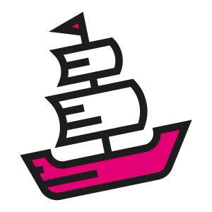

<p align="center"></p>

# Das Schiff

Das SCHIFF is a GitOps based Kubernetes Cluster as a Service platform almost exclusively built using open-source components. Created by and intended for production use at [Deutsche Telekom Technik](https://de.wikipedia.org/wiki/Telekom_Deutschland#Deutsche_Telekom_Technik_GmbH) to provide Kubernetes clusters to internal teams. It is hosted on-prem on both vSphere and bare metal at various private data centers in Germany.

This repository provides some insights into how Das Schiff works. It gives an overview of our architecture and describes the Git repository structure we are planning to scale to thousands of clusters.

Note: This repository is not code focused. We do have some open source components in other repos, but this one is about Das Schiff's design. It also does not contain a step by step guide on how to build your own Kubernetes platform. But we hope that you can learn something from our approach.

<!-- - [Das Schiff Pure Metal](schiff-pure-metal.md) - our approach to dynamic bare metal cluster provisioning
- [Das Schiff Liquid Metal](schiff-liquid-metal.md) - development to optimize Pure Metal for edge and far edge deployments with use of [microVM technology](https://www.weave.works/blog/multi-cluster-kubernetes-on-microvms-for-bare-metal). -->

## Our Open Source Projects

If we develop new components for our platform, we always consider whether we can open-source them, and we have published the following projects so far:

- [telekom/netplanner](https://github.com/telekom/netplanner) - a netplan.io compatible CLI with support for more netdev devices
- [telekom/das-schiff-network-operator](https://github.com/telekom/das-schiff-network-operator) - 
- [telekom/cluster-api-ipam-provider-in-cluster](https://github.com/telekom/cluster-api-ipam-provider-in-cluster) - a work-in-progress implementation of an in-cluster IPAM provider for the new [IPAM integration](https://github.com/kubernetes-sigs/cluster-api/pull/6000) in Cluster API that we are driving
- [telekom/das-schiff-operator](https://github.com/telekom/das-schiff-operator) - a collection of a few hacky controllers for ipam integration and backing up kubeconfig files to Git

## Our Challenge

Deutsche Telekom Technik (DTT) is a subsidiary of Telekom Deutschland, the leading integrated communications provider in Germany, which in turn is part of [Deutsche Telekom Group](https://www.telekom.com/en). Deutsche Telekom Technik handles the technical delivery of the communication services offered by Telekom Deutschland. It provides the infrastructure for more than 17.5M fixed line and 48.8M mobile customers.

Similar to all telco providers, we do not primarily run typical IT workloads. Instead we operate networks and run network functions, service platforms and the related management systems. Modern examples are 5G core, ORAN DU, remote UPF, BNG, IMS, IPTV and so on. Large portions of these functions and services are geo-distributed due to the nature of communications technology (e.g. mobile towers). Looking at Germany as a whole, we are talking about a few thousand clusters at hundreds of locations in Germany (when including far edge locations).

All of these workloads are rapidly transitioning towards a cloud native architecture. This creates a demand for modern platforms to run those workloads, which we aim to provide with Kubernetes. Das SCHIFF therefore set itself the following challenge:

> How can we manage thousands of Kubernetes clusters across hundreds of locations on both bare-metal servers as well as virtual machines, with a small, highly skilled SRE team, while only using open-source software?

## Our Solution

To tackle this problem we started building Das SCHIFF. Since then, we came up with a few principles that we now try to follow as closely as we can.

### GitOps to the core

Das Schiff is following the GitOps approach for everything we do. All configuration that does not come from external systems is derived from the content of a Git repository. Almost all the data is stored in the form of manifests, some of which contain nested configuration files though (e.g. Helm values files). All changes are performed as Pull Requests with validation and approvals.

### Full Automation

We try to automate whatever we can. This includes internal systems, some of which feel pretty legacy in a cloud-native world, as well as our network fabric. And of course the deployment and lifecycle of our clusters.

### Homogeneous Clusters

In order to manage a large amount of clusters with a small team, the clusters need to be as similar to each other as possible. We therefore avoid any configuration that is specific to a single customer. Most configuration is applied on a global scope, with environment and site specific overrides where necessary.

### Aggressive Upgrade Cycles

For clusters to stay homogenous, all of them should also be running the same software versions. To achieve this, we mandate a very aggressive upgrade strategy:

  - we have a test environment to which changes are applied very quickly and without notification in advance
  - after two weeks, changes are bundled and applied to the reference environment
  - after another two weeks, changes move to production

Our internal customers have the option to stop changes from progressing to their production clusters, but have to deal with the fallout when fast-forwarding them to the latest version on their own.

### Open-source only and upstream first

We have built Das SCHIFF almost exclusively using open source components, which is also the reason why we are publishing our architecture in this repository. There are some exceptions, but those are either temporary components or integrations to internal systems that we do not want to publish (and there would also be no use in doing so).

If we require a new feature, we avoid creating an internal fork and try to integrate the feature in the upstream open source project we are consuming. If that is not possible, we try to open source our custom implementation.

### Standalone clusters

Clusters have to be able to function, even when the management plane is unavailable. All clusters pull their configuration from Git autonomously. The management plane is only required to handle infrastructure changes and components deployed during bootstrapping, which includes CNI and Flux.

## Das Schiff Features

* **Multi-cluster**  
  The entire platform is distributed across many clusters. Tenants do not share clusters.
* **Multi-site**  
  The platform spans multiple sites, including edge and far edge locations in the future.
* **Infrastructure independent**  
  Our primary focus are bare-metal and vSphere based clusters, but public clouds can be supported as well.
* **Managed through GitOps**
  * Git serves as the primary source of truth (excluding external systems we integrate with)
  * Declarative description of infrastructure
  * Hard to mutate audit trail due to git history
  * Merge requests allow to review changes
* **Batteries Included**  
  Each cluster is ready to use and comes with
  * a monitoring stack for metrics
  * preconfigured networking according to the tenant's needs

## Das Schiff Components

The core of Das Schiff consists of Git (a GitLab instance in our case), the [Flux DevOps Toolkit](https://fluxcd.io) and [Cluster API](https://cluster-api.sigs.k8s.io), a Kubernetes subproject that allows managing Kubernetes clusters as resources in a management Cluster. Cluster API itself does not provide support for deploying to different infrastructures directly, but uses so-called infrastructure providers to do so. We are currently using the [metal3](https://github.com/metal3-io/cluster-api-provider-metal3) (for bare-metal; includes OpenStack Ironic and metal3's bare metal operator) and [vSphere](https://github.com/kubernetes-sigs/cluster-api-provider-vsphere) providers, but any other provider can be used with a few adaptions. Cluster API also abstracts cluster configuration into bootstrap and controlplane providers. It comes with providers that configure clusters using Kubeadm, which we use as well.

While we strive for homogenous clusters, 5G workoads can have pretty special network requirements. To suit all needs, clusters can run [Calico](https://www.tigera.io/project-calico/), [coil](https://github.com/cybozu-go/coil), [Multus](https://github.com/k8snetworkplumbingwg/multus-cni), [whereabouts](https://github.com/k8snetworkplumbingwg/whereabouts) and/or a custom [network-operator](https://github.com/telekom/das-schiff-network-operator). Storage is provided using NetApp Trident, Pure Storage Portworx or vSphere CSI, depending on the site and infrastructure the cluster is deployed on.

In addition we run several components on top of the clusters
  - All tenant clusters also run the Flux toolkit to pull their configuration from Git
  - The monitoring stack consists of [Prometheus](https://prometheus.io/), [Thanos](https://thanos.io/) and [Grafana](https://grafana.com/grafana/) and is deployed using [prometheus-operator](https://github.com/prometheus-operator/prometheus-operator) and [grafana-operator](https://github.com/grafana-operator/grafana-operator)
  - Logs are shipped to various destinations with [Vector](https://vector.dev/).
  - [Velero](https://velero.io/) is used for apiserver backups to internal S3 compatible storage
  - All clusters enforce community-recommended as well as internally required security policies using [Kyverno](https://kyverno.io/)
  - [RBAC Manager](https://github.com/FairwindsOps/rbac-manager) is used to make RBAC easier to handle
  - [metalLB](https://metallb.universe.tf/) acts as the load balancer for services

## Architecture

From a high level view, our architecture is pretty boring. We operate several management clusters that run Cluster API and the various providers we use. The clusters are separated by environment (test/reference and production), and for each environment there are multiple clusters at different sites. The management clusters take care of deploying tenant clusters at the various sites we offer. One management cluster is responsible for multiple sites. Each tenant cluster is only handled by a single management cluster.

Where it becomes interesting is our configuration management. As mentioned before, we are following the GitOps approach. This means that almost all of our configuration resides in Git repositories. We are currently using two repositories:
  - `cluster-definitions` holds all infrastructure (read: Cluster API) related manifests and a small amount of bootstrapping configuration
  - `cluster-components` contains the components that are deployed on top of the clusters and most of their configuration

Both of those repositories are pulled into clusters using Flux. Flux uses `GitRepository` and `Kustomization` resources in the cluster to configure what exactly should get pulled. `GitRepositories` primarily serve as a reference to a Git repository, but also allow to ignore specific files, similar to a `.gitignore` file. `Kustomizations` can then be used to apply a single path from a `GitRepository` to the cluster. And as the name suggest, `kustomize` will be used to do so, providing even more flexibility. The combination of both allows to be very specific about what should get applied to a cluster and what should not.

The `cluster-definitions` repository is only applied to the management clusters. It contains a folder per tenant cluster, structured as `<mgmt-cluster>/sites/<site>/<cluster-name>`. Each management cluster will just pull its respective folder. The `cluster-components` repository is a bit more complex and will be explained in more detail below (as will `cluster-definitions`). For now all you need to know is that its pulled in by both the management clusters (to do initial bootstrapping) and the tenant clusters (to fetch their configuration).

We also store secrets in Git. They are encrypted of course and we are using [sops](https://github.com/mozilla/sops) to do so, since Flux has an [integration](https://fluxcd.io/docs/guides/mozilla-sops/) for that.

### Deploying a Cluster

Lets have a look at the cluster deployment process to make this a little clearer. The following graphic shows a very rough visualization of a single management and a single tenant cluster, our git repositories, an engineer and a few errors that symbolize data flow and actions.

<p align="left"></p>

To deploy a cluster, an engineer will first create Merge Requests to both repositories (1). After they are merged (thanks to Kubernetes' eventual consistency order does not matter), the management cluster will at some point pull (2) the new manifests and apply them to its API server. As these resources include Cluster API manifests, Cluster API will start to deploy the tenant cluster to the infrastructure of choice.

At the same time, Flux will start to remotely apply a few bootstrap components to the tenant cluster (3). Initially this will not work of course, as the cluster and its API do not exist yet. But it will retry until it succeeds. Those bootstrap components consist of the CNI, Flux and configuration for Flux. From this point onward, the tenant cluster will pull the remaining configuration from the `cluster-components` repository on its own (4).

This is not a one-off process though. Flux continuously monitors the referenced Git repositories and will apply any changed manifests it detects. This allows to perform changes by creating more Git commits, and also reduces state drift as any deviations from the configuration stored in Git will be corrected.

### The Git repositories

As mentioned several times already, we are following the GitOps approach. One of the most important elements of our platform therefore are the repositories storing our configuration. Our goal is to keep all necessary information to recreate our infrastructure from scratch in Git. For any external systems we need to interact with, we attempt to use deterministic identifiers so we can link them to the data in Git, even if we loose data in the clusters.

We do not store all manifests that we deploy to our clusters in Git though. In some cases there is abstraction in place, and we only store the information necessary to derive all required manifests. A common example of such abstraction are operators. They hide all the deployment details behind a custom resource that allows to describe the desired configuration of e.g. some application, and the operator takes care of creating the necessary deployments and configmaps. We then only store the custom resource, not the deployments and configmaps.

In some cases we are working towards introducing more abstraction. One area is our `cluster-definitions` repository. Currently it contains all necessary Cluster API manifests for each cluster. We are in the process of creating a custom operator that can derive all required manifests from more abstract custom resources, combining a Cluster resource with site and environment specific configuration.

Since we are not there yet, here is the structure of our current `cluster-definitions` repository:

```bash
cluster-definitions 
├ schiff-management-cluster-x # definitions are grouped per management cluster
│ │
│ │ # The Cluster API deployment in a management cluster also manages the
│ │ # cluster it is deployed in, using the manifests located here.
│ ├ self-definitions  
│ │ ├ Cluster.yml
│ │ ├ Kubeadm-config.yml
│ │ ├ machinedeployment-0.yml
│ │ └ MachineTemplates.yml
│ │
│ │ # Each management cluster manages multiple sites, which are also grouped in
│ │ # folders ...
│ └ sites
│   ├ vsphere-site-1 # ... named after the site. 
│   │ ├ customerA # Clusters are further grouped by customer
│   │ │ └ customerA-1 # and in folders named after the cluster
│   │ │   │
│   │ │   │ # The bootstrap Kustomizations which are remotely applied to the
│   │ │   │ # tenant cluster by flux. It is using the Kubeconfig created by
│   │ │   │ # Cluster API as a secret to access the tenant cluster.
│   │ │   ├ kustomizations
│   │ │   │ ├ flux-kustomization.yaml
│   │ │   │ └ cni-kustomization.yaml
│   │ │   │
│   │ │   │ # regular Cluster API manifests
│   │ │   ├ Cluster.yml
│   │ │   ├ KubeadmControlPlane.yml 
│   │ │   ├ MachineDeployment.yml
│   │ │   ├ MachineHealthcheck.yml
│   │ │   └ MachineTemplate.yml
│   │ │
│   │ └ customerB # multiple customers per site
│   │   └ customerB-1
│   │     ┆ ...
│   │
│   └ baremetal-site-1 # and multiple sites per management cluster
│     └ customerA
│       └ customerA-1
│         ┆ ...
│
├ schiff-management-cluster-y # another management cluster
│  ├ self-definitions
│  │
│  └ sites
┆    ┆ ...
```

As you can see, it is not that complicated. All definitions are grouped by the management cluster that they belong to, making it a lot easier to pull them into the correct cluster. For each management cluster there are Cluster API manifests for the cluster itself, as Cluster API is able to perform rolling upgrades and scale the cluster it is running on. The clusters are in separate folders, grouped by site, the name of which contains the location and the infrastructure in use (bare metal or vSphere).

<!-- 

```yaml
---
apiVersion: kustomize.toolkit.fluxcd.io/v1beta1
kind: Kustomization
metadata:
  name: boostrap-location-1-site-1-customerA-1-cluster
  namespace: location-1-site-1
spec:
  interval: 5m
  path: "./locations/location-1/site-1/customerA-1"
  prune: false
  sourceRef:
    kind: GitRepository
    name: locations-location-1-site-1-main
    namespace: schiff-system
  decryption:
    provider: sops
    secretRef:
      name: sops-gpg-schiff-cp
  timeout: 2m
  kubeConfig:
    secretRef:
      name: customer_A-workload-cluster-1-kubeconfig
---
apiVersion: kustomize.toolkit.fluxcd.io/v1beta1
kind: Kustomization
metadata:
  name: boostrap-location-1-site-1-customer_A-workload-cluster-1-default-namespaces
  namespace: location-1-site-1
spec:
  interval: 5m
  path: "./default/components"
  prune: false
  suspend: false
  sourceRef:
    kind: GitRepository
    name: locations-location-1-site-1-main
    namespace: schiff-system
  decryption:
    provider: sops
    secretRef:
      name: sops-gpg-schiff-cp
  timeout: 2m
  kubeConfig:
    secretRef:
      name: customer_A-workload-cluster-1-kubeconfig
``` -->

The `cluster-components` repository is a bit more complex. Both, its structure and its history. Our initial approach was very hierarchical, with configuration at different locations overriding each other. This made the configuration very DRY (don't repeat yourself). But it was also hard to figure out where a specific value is coming from, and more importantly: it prevented us from performing staged rollouts of changes, or at least made them very difficult. Our current layout therefore bundles everything into *components* which are versioned. If you are interested in what exactly we changed and why, have a look [here](./cluster-components-history.md).

```bash
cluster-components
│ # Everything that is deployed on the cluster is wrapped in a component. The
│ # components are versioned and contain all configuration that is not
│ # cluster specific.
├ components
│ ├ flux
│ │ ├ v0.29.5
│ │ │ │ # Components always contain a base configuration ...
│ │ │ ├ base
│ │ │ │ ├ source-controller-deployment.yaml
│ │ │ │ ├ ...
│ │ │ │ └ kustomization.yaml
│ │ │ │ # ... which can then be overwritten. In this case the configuration
│ │ │ │ # differs by the network zone in which the cluster is deployed.
│ │ │ ├ intranet
│ │ │ │ └ kustomization.yaml
│ │ │ └ internet
│ │ │   └ kustomization.yaml
│ │ ├ v0.28.5
│ │ │ ┆ ...
│ │ ┆ ...
│ │
│ ├ rbac
│ │ └ v0.1.0
│ │   ├ base
│ │   │ ├ roles
│ │   │ │ ┆ ...
│ │   │ ├ ...
│ │   │ ├ rbac-manager-deployment.yaml
│ │   │ └ kustomization.yaml
│ │   │ # Configuration could also differ by environment, or even a
│ │   │ # combination of both. Each variant contains a kustomziation file
│ │   │ # that pulls in the base. This way a component can be deployed by
│ │   │ # providing the full path to the desired variant in the Kustomization
│ │   │ # resource.
│ │   ├ tst
│ │   │ └ kustomization.yaml
│ │   ├ ref
│ │   │ └ kustomization.yaml
│ │   └ prd
│ │     └ kustomization.yaml
│ │
│ ├ monitoring
│ │ ┆ ...
│ ┆ ... # there are many more components of course
│
│ # configuration that is applied to clusters is grouped by locations
├ locations
│ ├ location-1
│ │ └ site-1 # and then sites
│ │   ├ customerA-1 # and of course cluster
│ │   │ ├ cni
│ │   │ │ ├ clusterrolebindings
│ │   │ │ ├ clusterroles
│ │   │ │ ├ configmaps
│ │   │ │ ├ crds
│ │   │ │ └ serviceaccounts
│ │   │ ├ configmaps
│ │   │ ├ gitrepositories
│ │   │ ├ kustomizations
│ │   │ └ secrets
│ │   └ customerB-workload-cluster-1
│ │     ┆ ...
│ └ location-2
```

### The Future

We have already ran into a few issues with the new approach for components. We will therefore start migrating them to helm charts. To avoid helm subcharts, the components in helm format will create `HelmReleases` and config maps containing the necessary values to deploy the charts using Flux. The most important reasons for the switch are the following:

  * Everything is contained in one Flux resouce, a `HelmRelease` instead of having a `Kustomization` and a `GitRepository` that are co-dependant
  * It is easier to feed the properties of a cluster (e.g. environment, site) into charts than `Kustomizations`
  * Helm's templating is more powerful than kustomzie, which should make configuration easier in a few cases

## We're Hiring!

If all of this sounds interesting to you, and you want to help building and operating a Kubernetes platform with us, and are living somewhere in Europe, we have good news: we're hiring!

We are looking for Site Reliability Engineers and Go Developers that have experience with Kubernetes, GitOps (we're using flux), Cluster API (and the CAPV and CAPM3 providers), network fabrics, Prometheus, GitLab, Software Engineering in Go and working on Open Source projects. Of course you do not need to know about all of these topics, especially if you are eager learn.

If we've caught your interest, please get in touch with [@vukg](https://github.com/vukg), our squad lead, on [LinkedIn](https://www.linkedin.com/in/vuk-gojnic/) or [Twitter](https://twitter.com/vukgojnic)!

## Conference Talks and Media Coverage

#### 2022
- [Making On-Prem Bare-Metal Kubernetes Network Stack Telco Ready](https://kccnceu2022.sched.com/event/ytuA), KubeCon Europe 2022

#### 2021

- [Semaphore Uncut with Darko Fabijan](https://semaphoreci.com/blog/cloud-native-adoption-vuk-gojnic)
- [Art of Modern Ops with Cornelia Davis](https://www.weave.works/blog/kubernetes-at-deutsche-telekom-gitops-at-the-edge)
- KubeCon Europe 2021 Keynote: [How Deutsche Telekom built Das Schiff to sail Cloud Native Seas](https://www.youtube.com/watch?v=s0UKWiNNFTM)

#### 2020

- [Das Schiff at Cluster API Office Hours Apr 15th, 2020](https://youtu.be/yXHDPILQyh4?list=PL69nYSiGNLP29D0nYgAGWt1ZFqS9Z7lw4&t=251)

## Questions & Answers

### Can Das Schiff be used outside of Deutsche Telekom Technik?

No. Or at least - not exactly. Since most of Das Schiff is open source, you can build your own platform using the same components, and if it fits your needs, mimicking our repositories. But Das Schiff as a whole is tightly integrated into internal systems at Deutsche Telekom Technik, and those integrations are probably of little use for you. If you need help doing so, feel free to reach out to our friends from [Weaveworks](https://www.weave.works/), who are helping us build Das Schiff.

### Is Das Schiff part of any industry initiative?

The [CNCF CNF-WG](https://github.com/cncf/cnf-wg) is an attempt to create momentum for transforming the delivery of telco and CNFs, and we are actively contributing to it from our platform operations perspective.

## License

```
Copyright (c) 2022 Deutsche Telekom AG.

Licensed under the **Apache License, Version 2.0** (the "License"); you may not use this file except in compliance with the License.

You may obtain a copy of the License at https://www.apache.org/licenses/LICENSE-2.0.

Unless required by applicable law or agreed to in writing, software distributed under the License is distributed on an "AS IS" BASIS, WITHOUT WARRANTIES OR CONDITIONS OF ANY KIND, either express or implied. See the [LICENSE](./LICENSE) for the specific language governing permissions and limitations under the License.
```
