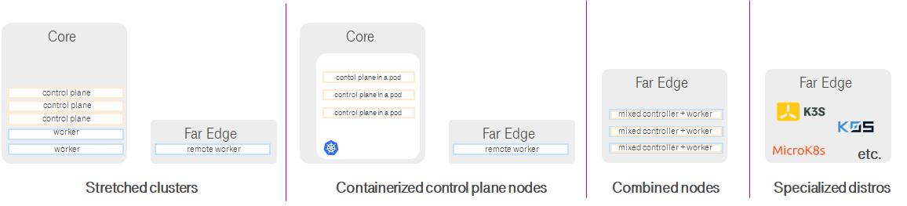
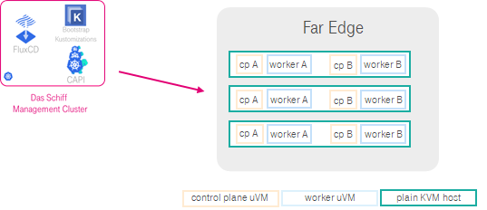
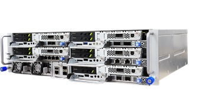
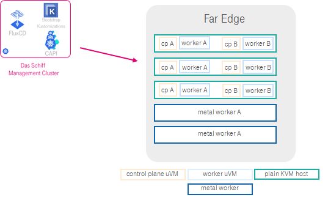
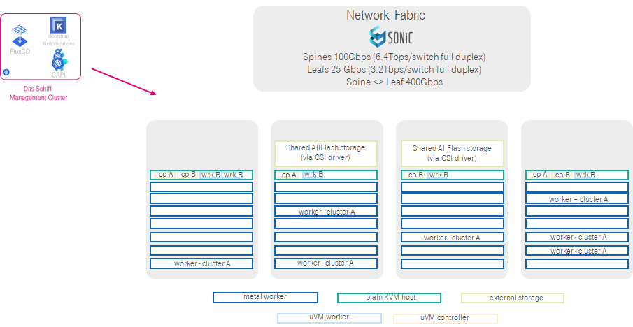

# Das Schiff Liquid Metal

## This is still work in progress - not used in the production yet

## Introduction
Das Schiff Liquid Metal is further development of [Das Schiff Pure Metal](schiff-pure-metal.md) which aims to make bare-metal clusters suitable for resource constrained far edge environments. 

However it also opens the doors to significantly increase efficiency of bare-clusters management in large core locations and enable smaller workloads to run on bare metal pools.

We work on this development together with Weaveworks who has used advancements in [Firecracker MicroVM](https://github.com/firecracker-microvm/firecracker) technology, that can be managed in GitOps way, to make it possible to [quickly create many CNCF conformant Kubernetes clusters on limited number of physical hosts](https://www.weave.works/blog/multi-cluster-kubernetes-on-microvms-for-bare-metal).

## Motivation

We have seen number of attempts to fit and manage Kubernetes on the edge on bare metal.

However none of those approaches caters for complete lifecycle management of standalone, highly available, GitOps managed Kubernetes clusters on bare-metal.

* Option with Streatched Clusters is making far Edge Site dependent on Core site while option with containerized control plane nodes has the same with additional requirement to have extra Kubernetes cluster for them.
* Option with combined control plane and worker nodes builds on anti-pattern and opens the risks for racing conditions between system and application workloads and is difficult for lifecycle nmanagement.
* Dedicated distributions, while minimizing fooptrint and complexity of Kubernetes cluster do nothing to bootstrap the bare-metal hosts - thus requiring additional components that are adding complexity for far edge scenarios.

We believe that far edge clusters need to be standalone and follow general design patterns of Kubernetes. One of those is having 3 cleanly separated master nodes as well as minimum 2 or preferrably 3 cleanly separated worker nodes.

This all comes very important especially when there is need to host remote 5G UPF, 5G Campus Network functions, FTTH access node or similar. 

Furthermore, if sole purpose of infrastructure in question is to run Kubernetes clusters than bare-metal clusters are right way to go and traditional heavyweight enterprise virtualization would be just overhead. However, lightweight virtualization can help significantly improve efficiency and enable elimination for dedicated hosts for control plane nodes.

## Liquid Metal approach

In Liquid Metal we are primarily replacing dedicated bare-metal metal control plane nodes with microVM based control plane nodes running on small set of bare-metal servers. It enables us to pack multiple and propper Kubernetes clusters on just 3 nodes. with some trade offs it could work on 2 nodes as well. 

Das Schiff Management Cluster takes care to establish plain KVM hosts using [Pure Metal](schiff-pure-metal.md) mechanisms and than following similar declarative & GitOps approach schedule control plane and worker nodes as microVMs (uVM).

This smallest footprint can cover all applications that do not require hardware acceleration, SR-IOV, XDP, GPU access, iSCSI storage attachment, crypro acceleration etc. which are typically required by CNFs. However it is very easy to extend this approach to cover all those cases.

Using small form factor edge hardware solutions like [OCP's OpenEdge](https://www.opencompute.org/wiki/Telcos/Edge) which we use (see below) and Das Schiff Liquid Metal, it is possible to create full fledged clusters that offer all capabilities for CNFs on the edge without restrictions and without complications.

This realized by so called "mixed mode" clusters where control plane nodes and part of worker nodes are running as uVMs, while other part of worker nodes is running as bare-metal nodes according [Pure Metal](schiff-pure-metal.md) setup.

On this picture we see one OpenEdge chassis with 5 nodes (sleds) which are hosting 2 CNCF conformant Kubernetes clusters:
* **Cluster A**: with 3 uVM based worker nodes and 2 metal worker nodes (suitable for CNFs)
* **Cluster B**: with 3 uVM based worker nodes (suitable for management apps or similar workloads)

Both of above scenarios are realized and proven in PoC setup. While we are working on making it ready for the production, you can read more about it in related blog [Multi Cluster Kubernetes on microVMs for bare-metal](https://www.weave.works/blog/multi-cluster-kubernetes-on-microvms-for-bare-metal) from [Weaveworks](https://www.weave.works).

Finally, our the ultimate goal with Liquid Metal is to make it general platform for running any type of workloads on bare-metal clusters in any type of location (core, edge and far edge). It will cover demanding CNFs as well as those workloads for which [Pure Metal](schiff-pure-metal.md) is overdimensioned. 

Liquid Metal helps us eliminate need for special server type for controllers, thus achieve uniform server hardware based only on one **generic server** type (64 vCPUs, 256GB RAM, 800GB SSD, 4x 25GbE NIC with hw acceleration) and thus we reduce hardware footprint in the data centers.

In the pool of such generic servers limited subset of the nodes serve as plain KVM hosts and hold control plane nodes and worker nodes for smaller clusters, while other servers server as bare metal worker nodes in clusters for more demanding applications. It is all dynamically managed by Das Schiff Management Cluster.

We would be thrilled to engage in the [discussion](../../discussions) with wider community related of Liquid Metal.

