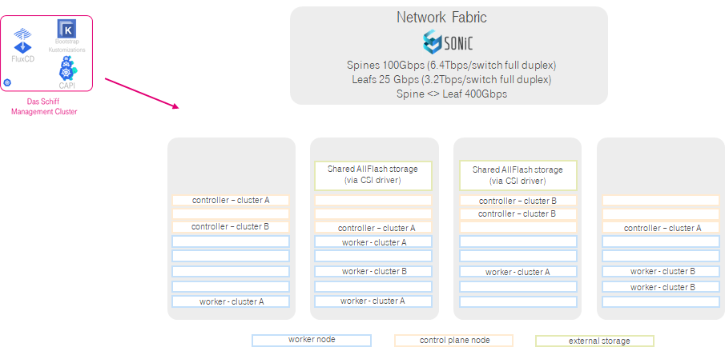
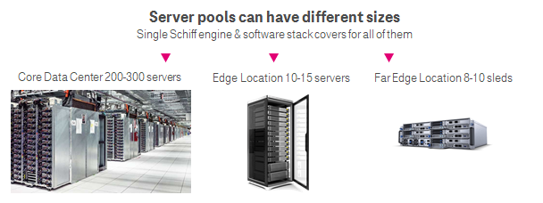

# Das Schiff Pure Metal

## Introduction
This document describes Das Schiff Pure Metal - our approach to dynamically manage multiple bare-metal Kubernetes clusters using [Das Schiff Engine](README) and only bare-metal servers

## Motivation

If you need to run Cloud Native Network functions (CNFs), especially those that forward large amount of data traffic 5G Core or ORAN vBBU, or if you need to run performance hungry applications that require lot of storage througput the most effective option is to run them on bare-metal Kubernetes clusters. 

Bare-metal clusters have several key benefits over other approaches:
* More performance & less overhead
* Reduced complexity & less moving parts
* Easy and hard multi-tenancy - one bare-metal host belongs to one cluster only
* Uncomplicated usage of hardware acceleration and direct hardware access
* Highest flexibility to adapt the host level config to application needs

This is why we invested efforts to master ceration and management of many bare-metal clusters on bare-metal server pools.

## Pure Metal approach

The naming comes from fact that each Kubernetes node is a physical server.

The configuration of these servers differs greatly from the typical configuration for virtualized environments since they need to suite Kubernetes needs. This means that we use smaller single socket nodes and cluster scaling to provide desired capacity.

Currently used server hardware that we use has following general specs:
* **Control plane node**: 4 vCPUs, 32GB RAM, 800GB SSD, 4x 1GbE NIC
* **Worker node**: 64 vCPUs, 256GB RAM, 800GB SSD, 4x 25GbE NIC with hw acceleration

Since the running node instances are ephemeral and are frequently exchanged we went with external storage for persistencty. The persistent volumes are dynamically created via corresponding CSI drivers.

Everything is interconnected via DC fabric based on [SONiC](https://azure.github.io/SONiC/) netowrk operating system.

The typical setup is illustrated on the picture below:

The pool of servers is managed by [GitOps loop](README#das-schiff-loop) of Das Schiff Management cluster for sole purpose of creating and maintaining bare-metal customer clusters. The picture shows situation with one server pool in one location that is hosting two clustomer clusters - cluster A and cluster B. The rest of the servers in the pool are free for creation of other clusters, expansion of existing clusters as well as reserve for failover and lifecycle management purposes. 

## Use cases for Das Schiff Pure Metal

This appraoch fits almost into all for factors. It can be used in core data centers with sizable amount of compute ressources as well as in edge and far edge locations.

Das Schiff Pure Metal can run any cloud native application. Hovwewer typical applications that run there are:
* 5G Core
* 5G UPF (User Plane Functions)
* 5G AUSF
* ORAN vBBU
* Large Kafka deployments (100s of TB)
* Large Elasticsearch deployments (100s of TB)
* etc.

### Limitations of Pure Metal

Pure Metal When it comes to very constrained environments like far edge with 3-5 available servers.

As minimal reasonable number of worker nodes in one cluster is 3 the minimal ressources of the cluster are **192 vCPUs** and **768GB RAM**. Therefore it is not efficient to use it deployments of smaller applications.

Due to these limitations we are workng on [Das Schiff Liquid Metal](schiff-liquid-metal) which targets to use the lightweight virtualization technology such as [Firecracker microVM](https://github.com/firecracker-microvm/firecracker) to eliminate these limitations and opens doors for endless possibilities when it comes to managing kubernetes clusters on pools of bare-metal servers.
